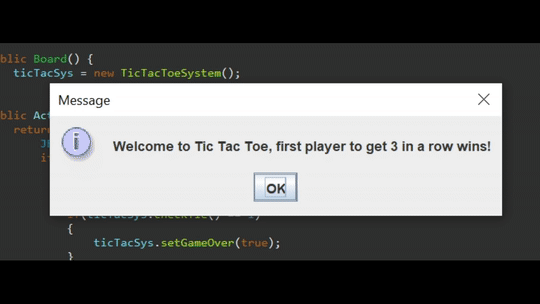
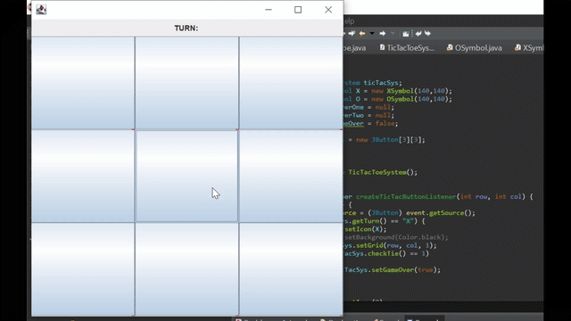
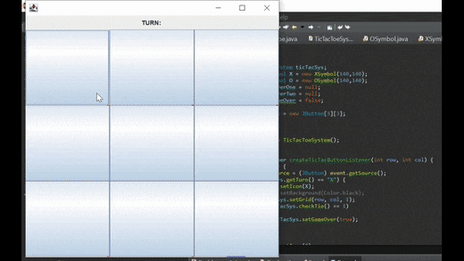

# Tic Tac Toe

## Developers

- Kenny Lazaro
- Kevin Nguyen
- Tien Nguyen

## Description

- This Tic Tac Toe game uses a GUI to simulate the classic Tic Tac Toe game where players compete to see who is able to get three in a row in a simple 3x3 grid.
- This game will ask for the player's name to show who wins after every round.
- If the game ends by a player winning or the game resulting in a tie, the game will reset

## File Info

- [**Board**](https://github.com/TienNguyen072399/CS-151-Project/blob/master/TicTacToe/src/Board.java) :
  - Creates the actual board for players to play on
  - Allows players to click an area on the grid to input their O or X
  - Draws the O or X Symbol when the player clicks on the board
  - Restarts the board when the game ends or results in a tie
- [**TicTacToeSystem**](https://github.com/TienNguyen072399/CS-151-Project/blob/master/TicTacToe/src/TicTacToeSystem.java) :
  - Keeps track whose turn it is
  - Checks who is the first to get three in a row
  - If the board is full and nobody is able to complete three in a row, results in a tie
- [**TicTacToe**](https://github.com/TienNguyen072399/CS-151-Project/blob/master/TicTacToe/src/TicTacToe.java) :
  - Runs the game and asks for the players' name
  - Creates the board

## Build Instructions
1. Install [Eclipse IDE for Java Developers](https://www.eclipse.org/downloads/packages)
2. Clone repository to a directory
3. Once installed, create a workspace and drag all the files from the directory into the workspace.
4. Run TicTacToe.java
5. Play!

 

   
  <h2>Launching the game</h2>
  
   
   
  <h2>Quick Gameplay</h2>
  
   
   
  <h2>Tie</h2>
  
   

